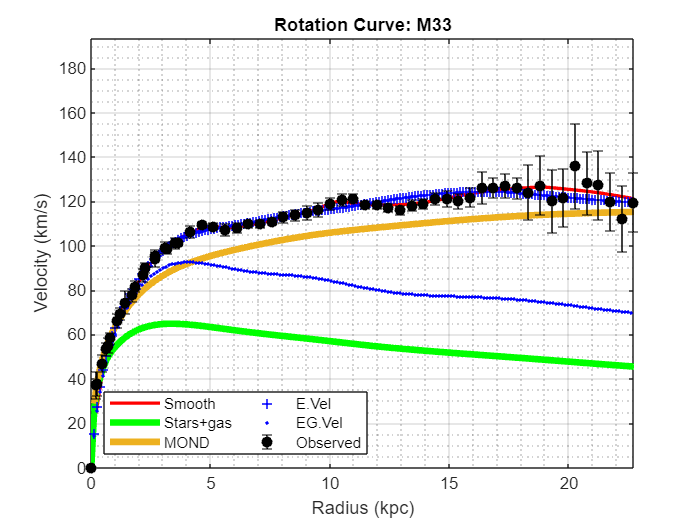
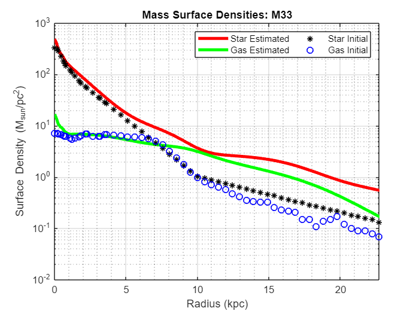
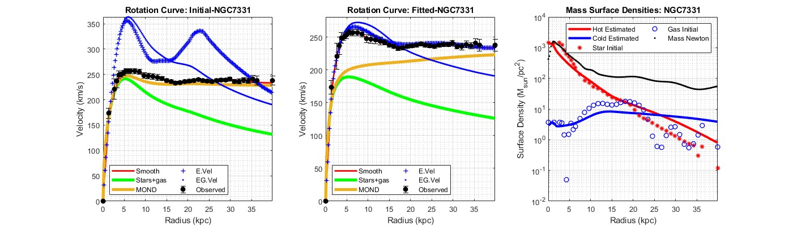
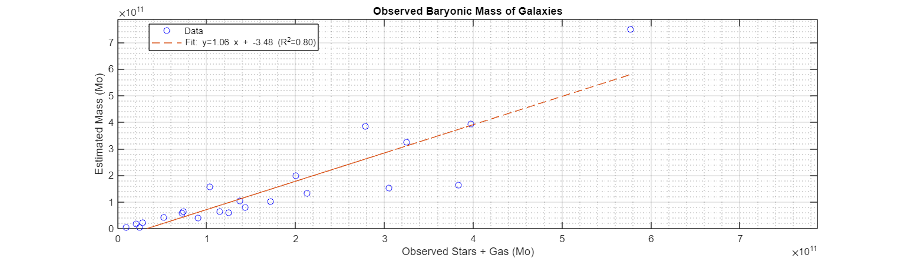

# Finite-Sized Particle Interaction Model

This repository is a work in progress and contains the MATLAB scrips of a novel model of particle-particle interactions, demonstrating how **electrostatic**, **magnetic**, and **gravitational forces** emerge from a Galilean framework of finite-sized particles emitting and absorbing **vector corpuscles**. The model challenges conventional physics by proposing that these forces arise from corpuscle exchanges, potentially eliminating the need for dark matter in explaining galactic rotation curves.

## Model Overview

The model assumes a universe filled with **vector corpuscles**—hypothetical entities carrying position, velocity, and orientation—that mediate interactions between finite-sized particles. Each corpuscle is characterized by:

-   **Position**: $\mathbf{x_c}$,

-   **Velocity**: $\mathbf{v_c}$,

-   **Orientation**: $\mathbf{o_c}$ a unit vector.

The corpuscle velocity follows **Galilean relativity**:

$$ \mathbf{v_c} = \mathbf{v_p} + \mathbf{c},$$

where $\mathbf{v_p}$ is the velocity of the emitting particle, and $\mathbf{c}$ is a vector with magnitude equal to the speed of light $c$. The orientation, $\mathbf{o_c}$, is defined at the moment the corpuscle is emitted by the particle.

## Finite-Sized Particles

The model defines two types of particles, each emitting $q$ corpuscles per second:

-   **Positive particles** $\mathbf{p^+}$ : Emit corpuscles with orientation **parallel** to their velocity:

$$ \mathbf{o_c} \cdot \mathbf{c} = c.$$

-   **Negative particles** $\mathbf{p^-}$ : Emit corpuscles with orientation **anti-parallel** to their velocity:

$$ \mathbf{o_c} \cdot \mathbf{c} = -c.$$

The emission of the corpuscles is isotropic, and at the speed of light $c$.

Particles **absorb** the corpuscles from the surrounding medium. The absorption process generates an **action** that alters the particle's velocity based on the corpuscles' density, velocity, and orientation:

-   For $\mathbf{p^+}$ , the action aligns with the absorbed corpuscle’s orientation.

-   For $\mathbf{p^-}$ , the action opposes the absorbed corpuscle’s orientation.

## Electrostatic Force

The model predicts that the net force $\mathbf{f_2}$ of the particle absorbing corpuscles $q_2$ (Absorbing) of an emitting charge $q_1$ (Emitting) and (e.g., electron charges $e$ separated by distance $r$ (at emitting-absorbing) is:

$$ \mathbf{f_2} = \frac{k q_1 q_2}{4 \pi r^2} \frac{\|\mathbf{c} + \mathbf{v_1}\|}{c}  \left( \frac{\mathbf{c} \cdot ( \mathbf{c} + \mathbf{v_1} - \mathbf{v_2} )}{\|\mathbf{c}\| \|\mathbf{c} + \mathbf{v_1} - \mathbf{v_2}\|} \right)^2 \hat{o_1},$$

where:

-   $k$: Coulomb constant,

-   $q$ is positive ($>0$) for $\mathbf{p^+}$ and negative ( $<0$) for $\mathbf{p^-}$

-   $\mathbf{v_1}, \mathbf{v_2}$: Velocities of the two particles:

    -   $\mathbf{v_1}$ is an emitting particle. $\mathbf{v_2}$ the absorbing particle

-   $\hat{o_1}$: Unit vector of the corpuscle orientation at the time of its origin by the emitting particle.

This force generalizes Coulomb’s law by incorporating velocity-dependent effects.

## Mass and Inertia

Inertia is implicit in the model, and the mass of particles in a direct consequence of the finite-sized particle model. The inertial mass of a finite-sized particle is proportional to its radius and charge distribution. For charged particles, the mass is related to the **electrostatic stored energy** divided by ( c\^2 ):

$$ m \propto \frac{\text{Electrostatic energy}}{c^2}.$$

The Mass folder derives the E=mc\^2 formula.

## Magnetic Force

The **magnetic force** and the **vacuum magnetic permeability** emerge from interactions between **neutral currents** (e.g., moving neutral particles) and moving charged particles , driven by the exchange of vector corpuscles. Evidence is presented in the MagneticForce folder for a current in a loop.

## Gravitational Force

**Gravity** arises as a net attractive force between **neutral composite particles** (e.g., atoms with a positively charged nucleus and a negatively charged shell). The slight difference in stocastic velocity distributions between positive and negative charges results in an Expected small attraction. The equations of interaction are derived in the GravityForce/SteadySate folder

## Galactic Rotation Curves

The velocity-dependent nature of the gravitational force implies that **"hot" ionized particles** in neutral plasma (with high velocities) behave differently from **"cold" neutral particles**. This difference accounts for the observed **flattening of galactic rotation curves**, potentially eliminating the need for dark matter in this model. Simulations in this repository demonstrate how these effects align with observed galactic dynamics. The results of fitting observed rotation curves of 22 SPARC galaxies and the local group are shocased in the Galaxies folder.

{width="392"}

{width="383"}

The evaluation of the 22 galaxies implies that there is no need for Dark mater:

Collaboration is welcome. Please send me comments, corrections and suggestions.
