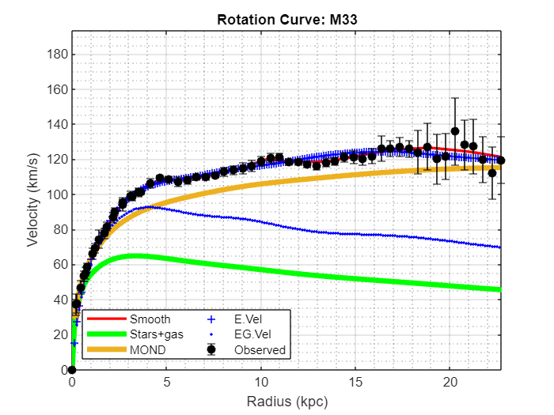
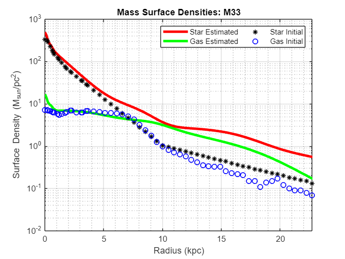
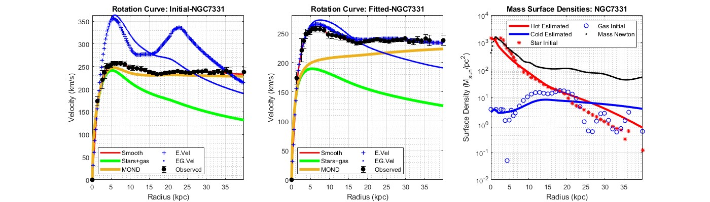
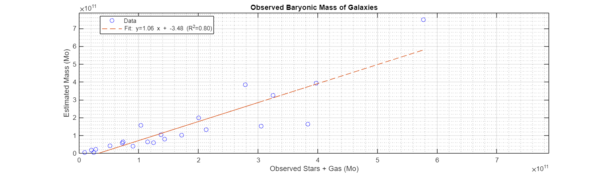

# Finite-Sized Particle Interaction Model

This repository is a work in progress and contains the MATLAB scripts of a novel model of particle-particle interactions, demonstrating how **electrostatic**, **magnetic**, and **gravitational forces** emerge from a Galilean framework of finite-sized particles emitting and absorbing **vector corpuscles**. The model challenges conventional physics by proposing that these forces arise from corpuscle exchanges, potentially eliminating the need for dark matter in explaining galactic rotation curves.

## Model Overview

The model assumes a universe filled with **vector corpuscles**—hypothetical entities carrying position, velocity, and orientation—that mediate interactions between finite-sized particles. Each corpuscle is characterized by:

-   **Position**: $\mathbf{x_c}$,

-   **Velocity**: $\mathbf{v_c}$,

-   **Orientation**: $\mathbf{o_c}$ a unit vector.

The corpuscle velocity follows **Galilean relativity**:

$$ \mathbf{v_c} = \mathbf{v_p} + \mathbf{c},$$

where $\mathbf{v_p}$ is the velocity of the emitting particle, and $\mathbf{c}$ is a vector with magnitude equal to the speed of light $c$. The orientation, $\mathbf{o_c}$, is defined at the moment the corpuscle is emitted by the particle.

## Finite-Sized Particles

The model defines two types of particles, each emitting $q$ corpuscles per second:

-   **Positive particles** $\mathbf{p^+}$ : Emit corpuscles with orientation **parallel** to their velocity:

$$ \mathbf{o_c} \cdot \mathbf{c} = c.$$

-   **Negative particles** $\mathbf{p^-}$ : Emit corpuscles with orientation **anti-parallel** to their velocity:

$$ \mathbf{o_c} \cdot \mathbf{c} = -c.$$

The emission of the corpuscles is isotropic, and at the speed of light $c$.

Particles **absorb** the corpuscles from the surrounding medium. The absorption process generates an **action** that alters the particle's velocity based on the corpuscles' density, velocity, and orientation:

-   For $\mathbf{p^+}$ , the action aligns with the absorbed corpuscle’s orientation.

-   For $\mathbf{p^-}$ , the action opposes the absorbed corpuscle’s orientation.

# Corpuscular Action Model for Particle–Particle Interaction

This section describes the mechanistic action model describing the interaction between a receiver particle and corpuscles emitted by an independent emitting particle. The model is grounded in a corpuscular paradigm, wherein the universe is permeated by discrete corpuscles propagated at the speed of light. Particles emit and absorb these corpuscles at characteristic rates, mediating momentum transfer analogous to a radiative exchange process.

## Model Foundations

The interaction framework posits that emitting particles radiate corpuscles isotropically at a rate of $q$ corpuscles per second, with propagation occurring at the vacuum speed of light $c$. Receiver particles absorb incident corpuscles at a rate parameterised by $\mu$ (dimensions of inverse time), contingent upon the corpuscular flux intersecting the receiver.

Observations are conducted in a coordinate system centred on a stationary observer, from whose frame the velocity evolution of the receiver particle is described.

The system under consideration comprises a single emitting particle $\mathbf{p_e}$ and a single receiver particle $\mathbf{P_r}$, both potentially in motion. At emission time $t_o$, the emitter occupies position $\mathbf{x_e}(t_o)$ with velocity $\mathbf{v_e}(t_o)$, radiating at rate:

$$
q_e \propto r^3_p\rho_u\mu_e;
$$

where $\rho_u$ is the universal vacuum corpuscle density, $\mu_e$ the emission rate, and $r_p$ the particle radius. At absorption time $t$, the receiver is at $\mathbf{x_r}(t)$ with velocity $\mathbf{v_r}(t)$.

## Corpuscular Density and Flux

The number density of corpuscles at the receiver position is

$$
\rho(\mathbf{x_r}, t, t_o) = \frac{q_e}{4\pi (c \Delta t)^2 \|\mathbf{c}(t_o) + \mathbf{v_e}(t_o)\|},
$$

where $\Delta t$ is the propagation duration, and $\mathbf{c}(t_o)$ is the light-speed directional vector from emitter to receiver in the observer frame. The separation distance is $r(t, t_o) = \|\mathbf{x_r}(t) - \mathbf{x_e}(t_o)\|$, yielding an effective propagation speed $\|\mathbf{c}(t_o) + \mathbf{v_e}(t_o)\|$. Thus,

$$
\Delta t = \frac{r(t, t_o)}{\|\mathbf{c}(t_o) + \mathbf{v_e}(t_o)\|}.
$$

Substitution provides the density

$$
\rho(\mathbf{x_r}, t, t_o) = \frac{q_e \|\mathbf{c}(t_o) + \mathbf{v_e}(t_o)\|}{4\pi c^2 r^2(t, t_o)}.
$$

The vectorial flux relative to the moving receiver is

$$
\boldsymbol{\Phi}(\mathbf{x_r}, t, t_o) = \rho \, [\mathbf{c}(t_o) + \mathbf{v_e}(t_o) - \mathbf{v_r}(t)] = \frac{q_e \|\mathbf{c}(t_o) + \mathbf{v_e}(t_o)\|}{4\pi c^2 r^2(t, t_o)} \, [\mathbf{c}(t_o) + \mathbf{v_e}(t_o) - \mathbf{v_r}(t)].
$$

## Absorption Rate

Absorption is modeled as proportional to the incident flux, the receiver's effective cross-sectional area $\mathbf{A} = A \hat{\mathbf{o}}_e$ (where $\hat{\mathbf{o}}_e$ defines the corpuscle orientation at emission), and absorption efficiency. The absorbed corpuscle count per event is

$$
\text{Abs}(\mathbf{x_r}, t, t_o) = [\boldsymbol{\Phi}(\mathbf{x_r}, t, t_o) \cdot \mathbf{A}] \, (1 - e^{-\mu \delta t}),
$$

with transit time across the receiver

$$
\delta t = \frac{r_p}{\|\mathbf{c}(t_o) + \mathbf{v_e}(t_o) - \mathbf{v_r}(t)\|},
$$

and $r_p$ the receiver radius. For $r_p \to 0$ ($\delta t \approx 0$), this approximates to

$$
\text{Abs}(\mathbf{x_r}, t, t_o) = \frac{[\boldsymbol{\Phi}(\mathbf{x_r}, t, t_o) \cdot \mathbf{A}] \, \mu r_p}{\|\mathbf{c}(t_o) + \mathbf{v_e}(t_o) - \mathbf{v_r}(t)\|}.
$$

## Momentum Transfer and Action

Corpuscle absorption imparts $\mathbf{c}$ momentum per absorption along the incident orientation. The rate of change of receiver momentum satisfies

$$
\frac{d (m \mathbf{v_r}(t))}{dt} \propto \text{Abs}(\mathbf{x_r}, t, t_o) \left( \frac{[\mathbf{c}(t_o) + \mathbf{v_e}(t_o) - \mathbf{v_r}(t)] \cdot \mathbf{c}(t_o)}{\|\mathbf{c}(t_o) + \mathbf{v_e}(t_o) - \mathbf{v_r}(t)\|} \right) \hat{\mathbf{o}}_e(t_o).
$$

Consolidating terms yields the action expression

$$
\frac{d (m \mathbf{v_r}(t))}{dt} \propto A r_p \frac{q_e \mu}{4 \pi r^2} \frac{\|\mathbf{c} + \mathbf{v_e}\|}{c} \left( \frac{\hat{\mathbf{o}}_e \cdot (\mathbf{c} + \mathbf{v_e} - \mathbf{v_r})}{\|\mathbf{c} + \mathbf{v_e} - \mathbf{v_r}\|} \right)^2 \hat{\mathbf{o}}_e,
$$

where arguments $(t, t_o)$ are implied for brevity.

Assuming geometric scaling $A \propto r_p^2$, and that the two particles are identical with $\mu_e=\mu$, the action becomes

$$
\frac{d (m \mathbf{v_r}(t))}{dt} \propto r_p^6 \frac{\rho_u \mu^2}{4 \pi r^2} \frac{\|\mathbf{c} + \mathbf{v_e}\|}{c} \left( \frac{\hat{\mathbf{o}}_e \cdot (\mathbf{c} + \mathbf{v_e} - \mathbf{v_r})}{\|\mathbf{c} + \mathbf{v_e} - \mathbf{v_r}\|} \right)^2 \hat{\mathbf{o}}_e.
$$

## Dimensional Consistency

-   Distance terms: $r^2$ [m²], $r_p^3$ [m³]
-   Rates: $q_e$ [corpuscles s⁻¹], $\mu_r$ [s⁻¹]
-   Velocities: $c, v$ [m s⁻¹]
-   Densities: [corpuscles m⁻³]

The rate of corpuscle absorption (corpuscles s⁻¹) conforms dimensionally to

$$
\text{corpuscles m s}^{-2} \sim \text{m}^6 \cdot \frac{(\text{corpuscles m}^{-3}) \cdot (\text{s}^{-2})}{\text{m}^2} \cdot \frac{\text{m s}^{-1}}{(\text{m s}^{-1})},
$$

confirming that the derived action is proportional to the particle acceleration.

## Newton's First Law

In the absence of a external corpuscle, $q_e=0$, the momentum equation reduces to:

$$
\frac{d (m \mathbf{v_r}(t))}{dt} = 0
$$

In other words there is no change in the momentum. i.e.

"An object at rest stays at rest, and an object in motion stays in motion with the same speed and in the same direction, unless acted upon by an unbalanced external force."

## Newton's Second Law 

The momentum transferred and the absorbed should be in equilibrium.

$$ 
\frac{d (m \mathbf{v_r}(t))}{dt}_{in}=\frac{d (m \mathbf{v_r}(t))}{dt}_{ext} \therefore \frac{d (m \mathbf{v_r}(t))}{dt}_{ext} = -\frac{d (m \mathbf{v_r}(t))}{dt}_{in} 
$$

Here we derive the Newton's second law. First I'll assume that the absorbing particle is finite and composed by two absorbing/emitting elements separated by a distance $L$ aligned to the external flow of corpuscles. I'll assume that the internal elements have a radius $r_e=r_p/2$ the external force causes an small acceleration of the receiver particle. Therefore the front particle and the back particle at the time of action summation have a small velocity: $v_e=a \Delta_L t$; where $a$ is the instant acceleration due to the external action and $\Delta_L t=L/c$ is the amount of time required to travel the distance between the two particle elements.

The internal change of momentum of the dual element particle is:

$$
\frac{d (m \mathbf{v_r}(t))}{dt}_{in} \propto  \frac{\rho_u r_p^6 \mu^2}{256 \pi L^2} \left[ \frac{(c + a{ \Delta_L t})}{c} - \frac{(c - a{ \Delta_L t})}{c} \right]\hat{\mathbf{o}}_e.
$$

Substituting we get:

$$
\frac{d (m \mathbf{v_r}(t))}{dt}_{in} \propto  -\frac{\rho_u r_p^6 \mu^2}{256 \pi L} \left[ \frac{2a}{c^2} \right]\hat{\mathbf{o}}_e.
$$

Therefore:

$$
\frac{d (m \mathbf{v_r}(t))}{dt}_{ext} =  \frac{\rho_u r_p^6 \mu^2}{128 \pi L} \left[ \frac{1}{c^2} \right] a \hat{\mathbf{o}}_e.
$$

A close inspection of the equation it resembles: $F=ma$. And

$$
E_{in} \propto \frac{\rho_u r_p^6 \mu^2}{128 \pi L}=\frac{q^2}{16 \pi \epsilon_o L}
$$

is the internal stored electrostatic energy by the two charged elements with $q/2$ charge separated by a distance $L$. Hence the inertial mass is:

$$
m \propto E_{in}c^2.
$$

## Rate of emission-absorption

The internal energy equation $E_{in}$ can be used to estimate the rate of corpuscles 
absorbed-emitted at any given time by real particles. 
I'll assume the electron charge $e = 1.602176634 \times 10^{-19}$ C, and radius $r_e=10^{-20}$ m

$$
\rho_u r_p^6 \mu^2 \propto \frac{q^2}{\epsilon_o} \therefore \rho_u \mu^2 \propto \frac{e^2}{r_e^6 \epsilon_o} = 2.307 \times 10^{32} \text{ m}^{-3}\text{s}^{-2}
$$

This implies that an electron on average has $2.307 \times 10^{32}$ corpuscular interactions per second squared per cubic meter

## Electrostatic Force

The derived model can be described as a net electric force:

$$
\mathbf{f_2}=\frac{d (m \mathbf{v_r}(t))}{dt}
$$

of the particle absorbing corpuscles $q_2$ (Absorbing) of an emitting charge $q_1$ (Emitting) and (e.g., electron charges $e$ separated by distance $r$ (at emitting-absorbing) is:

$$ \mathbf{f_2} = \frac{k q_1 q_2}{4 \pi r^2} \frac{\|\mathbf{c} + \mathbf{v_1}\|}{\|c\|}  \left( \frac{\mathbf{c} \cdot ( \mathbf{c} + \mathbf{v_1} - \mathbf{v_2} )}{\|\mathbf{c}\| \|\mathbf{c} + \mathbf{v_1} - \mathbf{v_2}\|} \right)^2 \hat{o_1},$$

where:

-   $k$: Coulomb constant,

-   $q$ is positive ($>0$) for $\mathbf{p^+}$ and negative ( $<0$) for $\mathbf{p^-}$

-   $\mathbf{v_1}, \mathbf{v_2}$: Velocities of the two particles:

    -   $\mathbf{v_1}$ is an emitting particle. $\mathbf{v_2}$ the absorbing particle

-   $\hat{o_1}$: Unit vector of the corpuscle orientation at the time of its origin by the emitting particle.

-   $r$ is the distance traveled by the corpuscle form the emission origin to it absorption:

$$
    r=\| \mathbf{x_2}(t)-\mathbf{x_1}(t_o) \|.
$$

This force generalizes Coulomb’s law by incorporating velocity-dependent effects.

## Magnetic Force

The **magnetic force** and the **vacuum magnetic permeability** emerge from interactions between **currents** (e.g., moving charged particles in a neutral cables) and moving charged particles.

The presented corpuscular model correctly predict that the **vacuum magnetic permeability** $\mu_0$ and the electric constant are associated by:

$\epsilon_0 =\frac{1}{c^2 \mu_0 }$

The evidence is presented in the Magnetic Force folder for a current in a loop yields the exact equation predicted by the Lorentz force of a moving charged particle $Q$ in the center of a circular loop with current $I$ and radius $R$:

$$
F_m=\left(\begin{array}{ccc}
0 & -\frac{\textrm{I} Q \mu_0 v }{2 R} & 0
\end{array}\right)
$$

## Gravitational Force

**Gravity** arises as a net attractive force between **neutral composite particles** (e.g., atoms with a positively charged nucleus and a negatively charged shell). The slight difference in stochastic velocity distributions between positive and negative charges results in an Expected small attraction. The equations of interaction are derived in the GravityForce/Steady-sate folder

## Galactic Rotation Curves

The velocity-dependent nature of the gravitational force implies that **"hot" ionized particles** in neutral plasma (with high velocities) behave differently from **"cold" neutral particles**. This difference accounts for the observed **flattening of galactic rotation curves**, potentially eliminating the need for dark matter in this model. Simulations in this repository demonstrate how these effects align with observed galactic dynamics. The results of fitting observed rotation curves of 22 SPARC galaxies and the local group are showcased in the Galaxies folder.

{width="392"}

{width="383"}

The evaluation of the 22 galaxies implies that there is no need for dark matter for the explanation of the rotation curves:

Collaboration is welcome. Please send me comments, corrections and suggestions.
